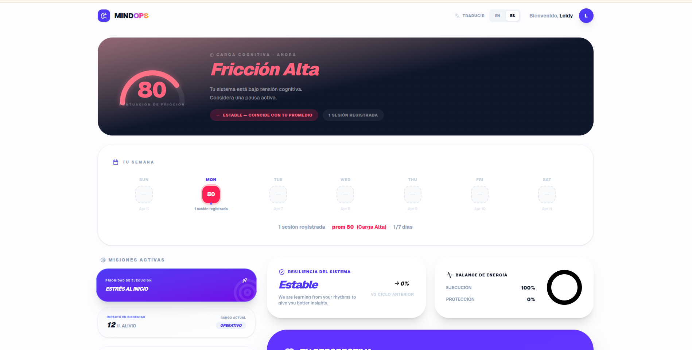
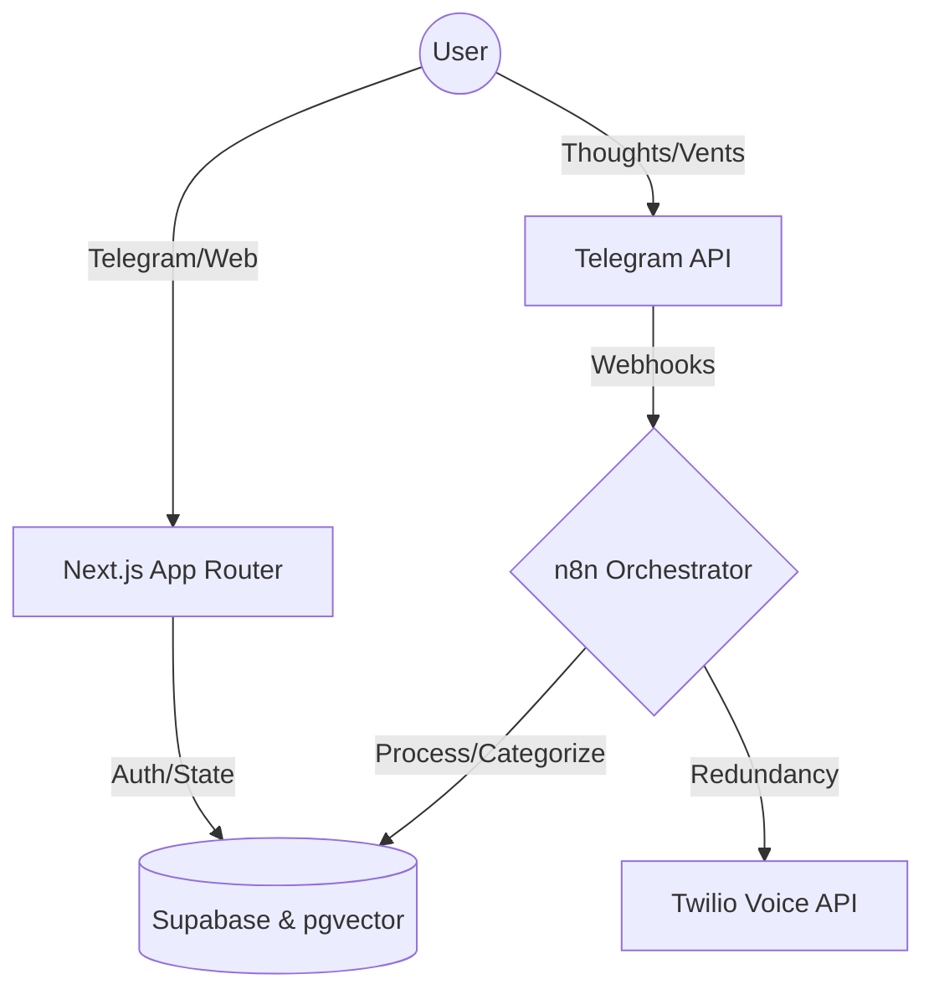

# 🧠 MindOps: Cognitive Load Balancer



MindOps is an **event-driven, multi-agent cognitive processor**. It's designed to take unstructured mental noise (rants, anxieties, chaotic thoughts) and compile it into deterministic, prioritized action plans. Think of it as a load balancer for your brain's working memory.

---

## 🎯 High-Value Use Cases

Building a task manager is easy. Organizing chaos is hard. Here is who MindOps is built for:

- **Founders & Indie Hackers:** You have 50 things to do across 4 projects and are paralyzed by context-switching. You vent to the bot: _"I need to fix the auth bug, but I'm worried about the AWS bill, and I haven't replied to Sarah."_ MindOps parses this, prioritizes the bug, schedules the bill review, and drafts a reminder for Sarah.
- **Engineers in "The Zone":** When you get blocked by side-quests or lose track of architecture thoughts. Brain-dump into Telegram, and let the asynchronous engine structure your next steps without you ever leaving your IDE or losing momentum.
- **ADHD & Neurodivergent Execution:** Acts as an external executive function system. It turns emotional, overwhelming states into calm, objective, `PENDING` database states. If you freeze and ignore the tasks, the **Twilio Safety Net** handles the edge case: it physically calls your phone to break the paralysis loop.

---

## 🚀 The User Loop (How It Works)

1. **Input (The Webhook):** You send an audio or text rant to the **MindOps Telegram Bot**.
2. **Processing (The Engine):** An asynchronous `n8n` pipeline processes the payload. It uses Semantic RAG to find historical context and an LLM to distill the rant into atomic actions.
3. **Execution (The Dashboard):** You log into the Next.js portal. Your chaos is now a neat, prioritized Board. You approve, modify, or complete tasks.

---

## ⚙️ System Architecture & Engineering

As an engineer, wrapping an LLM api call is trivial. Building a deterministic, resilient, and blazing-fast agentic system is complex. Here is how MindOps solves the hard parts:



### 1. Eliminating N+1 Latency via Context Injection Gateway

Instead of the orchestration engine making multiple sequential database calls to fetch user profiles, language preferences, and prompt templates, MindOps uses a **Context Injection Gateway**. A single, ultra-fast Supabase RPC (`get_bot_context`) hydrates the entire state into memory in one go. Downstream agents read directly from this `$json.context` payload, slashing execution latency.

### 2. Semantic RAG & Deterministic State Machine

LLMs hallucinate; state machines don't.

- **RAG:** MindOps uses `pgvector` to do k-NN cosine similarity searches in a 768-dimensional latent space. The AI engine understands _how_ you usually behave and responds with personalized context.
- **State Machine:** The AI doesn't execute blind system changes. It proposes "Atomic Actions" bounded by strict database constraints (Enums like `PENDING`, `ACTIVE`). Human-in-the-loop (HITL) is mandatory for final review.

### 3. Native Server-Side i18n (Zero Flicker)

Bilingual apps often suffer from hydration flicker. MindOps intercepts requests at the Next.js Edge using `middleware.ts`. It resolves locale via a strict hierarchy (URL > DB Profile > Telegram Session > Browser Header) and passes an `x-next-intl-locale` header to React Server Components. The result is **zero flash of the wrong language** on first load.

### 4. Infrastructure Architecture

The backend runs on a hyper-lean infrastructure designed to completely eliminate Cold Starts while remaining extremely memory efficient.
_(For a detailed breakdown of the hosting decisions, the execution model, and why we chose a monolith approach over queue/workers, see our [Infrastructure Logs](docs/INFRASTRUCTURE.md))._

---

## 💻 Local Setup (For Developers)

Want to spin up your own cognitive engine?

### Prerequisites

- Node.js (v18+)
- A [Supabase](https://supabase.com/) project
- A Telegram Bot Token

### Run Locally

```bash
git clone https://github.com/aleocampodev/mindops.git
cd mindops-web

# Install dependencies (React 19 requires --legacy-peer-deps for some libs)
npm install --legacy-peer-deps

# Configure environment variables
cp .env.example .env.local
# Edit .env.local to add your NEXT_PUBLIC_SUPABASE_URL and NEXT_PUBLIC_SUPABASE_ANON_KEY

# Boot the app
npm run dev
```

Visit `http://localhost:3000` to start debugging.

---

_Designed for efficiency. Built for the mind. ⚡_
